# Ansible Collection: Dreadnode Nimbus Range

[](https://github.com/dreadnode/ansible-collection-nimbus_range/actions/workflows/pre-commit.yaml)
[](https://github.com/dreadnode/ansible-collection-nimbus_range/actions/workflows/renovate.yaml)

This Ansible collection provides agent and logging setup functionality for
cloud-based ephemeral environments, focusing on operational telemetry
collection, session management, and centralized log forwarding.

## Architecture Diagram

```mermaid
graph TD
    Collection[Ansible Collection]
    Collection --> Plugins[Plugins]
    Plugins --> P0[getent_passwd]
    Plugins --> P1[merge_list_dicts_into_list]
    Plugins --> P2[vnc_pw]
    Collection --> Roles[Roles]
    Roles --> R0[acl_tools *]
    Roles --> R1[alloy]
    Roles --> R2[aws_cloudwatch_agent]
    Roles --> R3[aws_ssm_agent]
    Roles --> R4[base *]
    Roles --> R5[coercion_tools *]
    Roles --> R6[cracking_tools *]
    Roles --> R7[credential_access_tools *]
    Roles --> R8[dc_audit_sacl]
    Roles --> R9[fluent_bit]
    Roles --> R10[lateral_movement_tools *]
    Roles --> R11[mythic *]
    Roles --> R12[nats]
    Roles --> R13[privesc_tools *]
    Roles --> R14[recon_tools *]
    Roles --> R15[redis]
    Collection --> Playbooks[Playbooks]
    Playbooks --> PB0[ares]
    Playbooks --> PB1[linux]
    Playbooks --> PB2[windows]
```



## Requirements

- Ansible 2.18.4 or higher

## Installation

Install the latest version of the Nimbus Range collection:

```bash
ansible-galaxy collection install git+https://github.com/dreadnode/ansible-collection-nimbus_range.git,main
```

## Roles

### AWS CloudWatch Agent Setup

Installs and configures the **AWS CloudWatch Agent** for metrics and log
collection on Unix-like and Windows systems.

- Role docs: [`roles/aws_cloudwatch_agent/README.md`](roles/aws_cloudwatch_agent/README.md)

- Collects system metrics such as CPU, disk, memory, and network.
- Enriches metrics with AWS EC2 metadata.
- Automatically installs, configures, and ensures the CloudWatch Agent is running.

### AWS SSM Agent Setup

Installs and configures the **AWS Systems Manager (SSM) Agent** for secure
remote management and automation.

- Role docs: [`roles/aws_ssm_agent/README.md`](roles/aws_ssm_agent/README.md)

- Installs SSM Agent on Linux and Windows systems.
- Configures services to automatically restart and provides monitoring scripts.
- Ensures the SSM Agent is enabled and healthy after deployment.

### Fluent Bit Setup

Installs and configures **Fluent Bit** for log collection, enrichment, and
forwarding to OpenSearch.

- Role docs: [`roles/fluent_bit/README.md`](roles/fluent_bit/README.md)

- Collects Linux system logs and Windows Event logs.
- Captures AWS SSM session activity logs.
- Enriches logs with environment metadata and deployment context.
- Forwards logs securely to an OpenSearch cluster.

### Base Setup

Installs the base dependencies and workspace layout required for **Ares AI agents**.

- Role docs: [`roles/base/README.md`](roles/base/README.md)

- Bootstraps Python toolchains, pip packages, and system utilities.
- Optionally installs uv, Rust, and pipx for downstream tooling.

### ACL Tools Setup

Installs and configures **Active Directory ACL exploitation tools** for Ares agents.

- Role docs: [`roles/acl_tools/README.md`](roles/acl_tools/README.md)

### Cracking Tools Setup

Installs and configures **password cracking tools** and wordlists for Ares agents.

- Role docs: [`roles/cracking_tools/README.md`](roles/cracking_tools/README.md)

### Lateral Movement Tools Setup

Installs and configures **lateral movement tooling** for Ares agents.

- Role docs: [`roles/lateral_movement_tools/README.md`](roles/lateral_movement_tools/README.md)

### Recon Tools Setup

Installs and configures **reconnaissance tooling** for Ares agents.

- Role docs: [`roles/recon_tools/README.md`](roles/recon_tools/README.md)

### Credential Access Tools Setup

Installs and configures **credential access tooling** for Ares agents.

- Role docs: [`roles/credential_access_tools/README.md`](roles/credential_access_tools/README.md)

### Coercion Tools Setup

Installs and configures **coercion and relay attack tooling** for Ares agents.

- Role docs: [`roles/coercion_tools/README.md`](roles/coercion_tools/README.md)

### Privilege Escalation Tools Setup

Installs and configures **privilege escalation tooling** for Ares agents.

- Role docs: [`roles/privesc_tools/README.md`](roles/privesc_tools/README.md)

### Grafana Alloy Setup

Installs and configures **Grafana Alloy** on Windows hosts for log shipping.

- Role docs: [`roles/alloy/README.md`](roles/alloy/README.md)

### Mythic Setup

Installs and configures the **Mythic C2 framework** and optional agent packages.

- Role docs: [`roles/mythic/README.md`](roles/mythic/README.md)

## Usage

### Linux Example

```yaml
---
- name: Provision Linux Attack Range Box
  hosts: all
  gather_facts: true
  vars:
    fluent_bit_env: dev
    fluent_bit_deployment_name: default
    fluent_bit_opensearch_custom_domain: contoso.local
    fluent_bit_opensearch_username: admin
    fluent_bit_opensearch_password: password
    fluent_bit_version: "4.0.1"

  roles:
    # Nimbus Range roles for Ansible system configuration and monitoring
    - role: dreadnode.nimbus_range.aws_ssm_agent
    - role: dreadnode.nimbus_range.aws_cloudwatch_agent
    - role: dreadnode.nimbus_range.fluent_bit
```

### Windows Example

```yaml
---
- name: Provision Windows Attack Range Target
  hosts: all
  vars:
    fluent_bit_env: dev
    fluent_bit_deployment_name: default
    fluent_bit_opensearch_custom_domain: contoso.local
    fluent_bit_opensearch_username: admin
    fluent_bit_opensearch_password: password
    fluent_bit_version: "4.0.1"

  roles:
    # Nimbus Range roles for Ansible system configuration and monitoring
    - role: dreadnode.nimbus_range.aws_ssm_agent
    - role: dreadnode.nimbus_range.aws_cloudwatch_agent
    - role: dreadnode.nimbus_range.fluent_bit
```

## Development

This collection lives inside the [ares](https://github.com/dreadnode/ares)
repository and is consumed directly from this subdirectory — it is not
published to Ansible Galaxy. See [docs/development.md](docs/development.md)
for layout, pre-commit hooks (including the architecture-diagram regen),
molecule usage, and CI details.

## Support

- Repository: [dreadnode/ansible-collection-nimbus_range](https://github.com/dreadnode/ansible-collection-nimbus_range)
- Issue Tracker: [GitHub Issues](https://github.com/dreadnode/ansible-collection-nimbus_range/issues)
